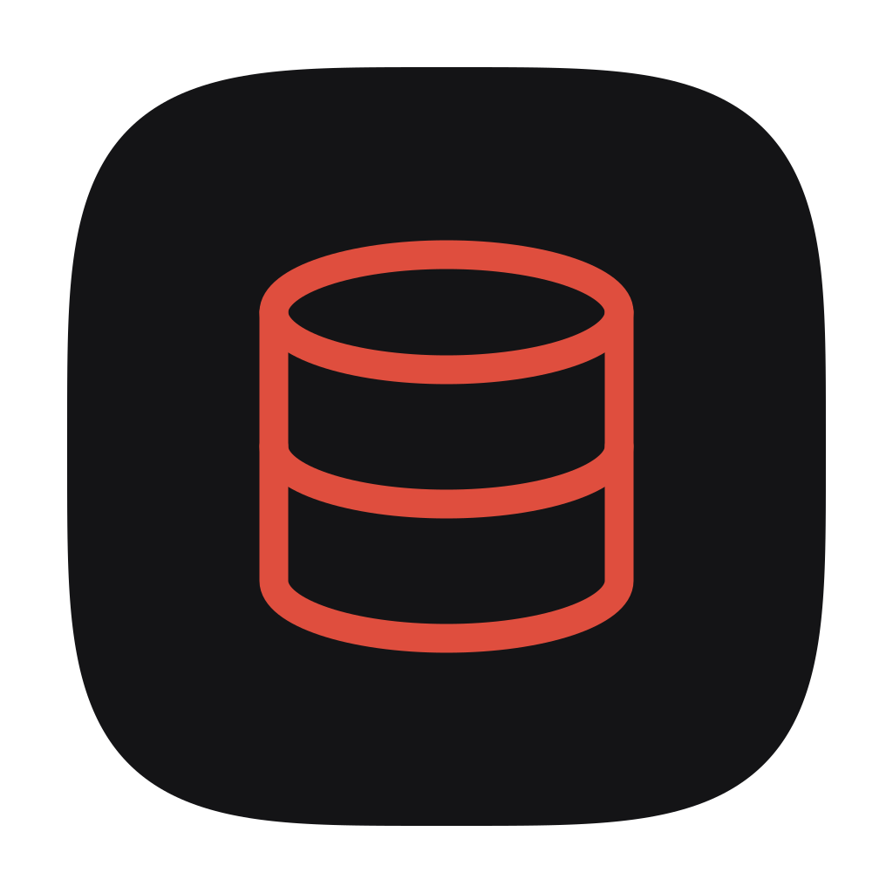

<p align="center">
  
</p>

<h1 align="center">BetterDB</h1>

<p align="center">
  A modern, cross-platform PostgreSQL database client built with Electron, React, and TypeScript.
</p>

<p align="center">
  
  
  
  
  
  
</p>

---

## About

BetterDB is a lightweight desktop application for managing PostgreSQL databases. It provides an intuitive interface for browsing schemas, writing queries, and editing data — without the bloat of traditional database GUIs.

## Features

- **Connection Manager** — Save and organize multiple PostgreSQL connections with SSL support. Compatible with Supabase and AWS RDS.
- **Schema Explorer** — Browse databases, schemas, tables, and views in a collapsible tree sidebar.
- **SQL Editor** — Write and execute queries with a CodeMirror-powered editor featuring SQL syntax highlighting and a dark theme.
- **Query Results** — View results in a fast, virtualized table with column type awareness and execution time metrics.
- **Inline Data Editing** — Edit cell values, insert rows, and delete records directly from the table view.
- **Paginated Table Viewer** — Navigate large tables with server-side pagination and sortable columns.
- **Foreign Key Introspection** — View column-level foreign key references across your schema.

## Architecture

```
electron/
  ├── db/
  │   ├── DatabaseAdapter.ts      # Abstract adapter (extensible to other engines)
  │   ├── PostgresAdapter.ts      # PostgreSQL implementation via node-postgres
  │   └── ConnectionManager.ts    # Singleton connection factory
  ├── ipc/
  │   └── handlers.ts             # IPC bridge between main & renderer
  └── storage/
      └── connections.ts           # Encrypted connection persistence
src/
  ├── components/
  │   ├── connections/             # Connection form & panel
  │   ├── query/                   # SQL editor & results
  │   ├── schema/                  # Schema tree browser
  │   └── table/                   # Virtualized table viewer
  ├── stores/                      # Zustand state management
  └── lib/
      └── ipc.ts                   # Typed IPC wrapper for renderer
shared/
  └── types.ts                     # Shared types across processes
```

## Tech Stack

| Layer     | Technology                         |
| --------- | ---------------------------------- |
| Framework | Electron 30                        |
| Frontend  | React 18, TypeScript               |
| Bundler   | Vite 5 with `vite-plugin-electron` |
| Styling   | Tailwind CSS, shadcn/ui            |
| State     | Zustand                            |
| Editor    | CodeMirror 6                       |
| Tables    | @tanstack/react-virtual            |
| Database  | node-postgres (`pg`)               |

## Getting Started

### Prerequisites

- **Node.js** >= 18
- **npm** >= 9

### Development

```bash
npm install
npm run dev
```

This launches the Electron app in development mode with hot module replacement.

### Production Build

```bash
npm run build
```

Generates a distributable package in the `release/` directory for your platform.

### Lint

```bash
npm run lint
```

## Roadmap

- [ ] MySQL / SQLite adapter support
- [ ] Query history and saved queries
- [ ] Export results to CSV / JSON
- [ ] Table structure editor (DDL)
- [ ] Multiple query tabs

## License

MIT © [asallh](https://github.com/asallh). See [LICENSE](LICENSE) for the full text.
